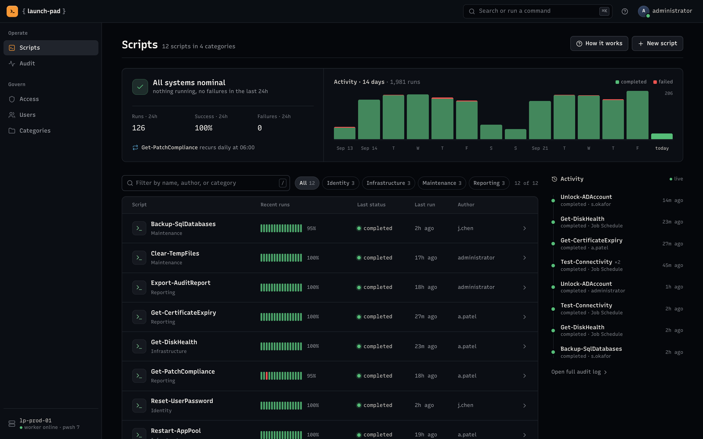
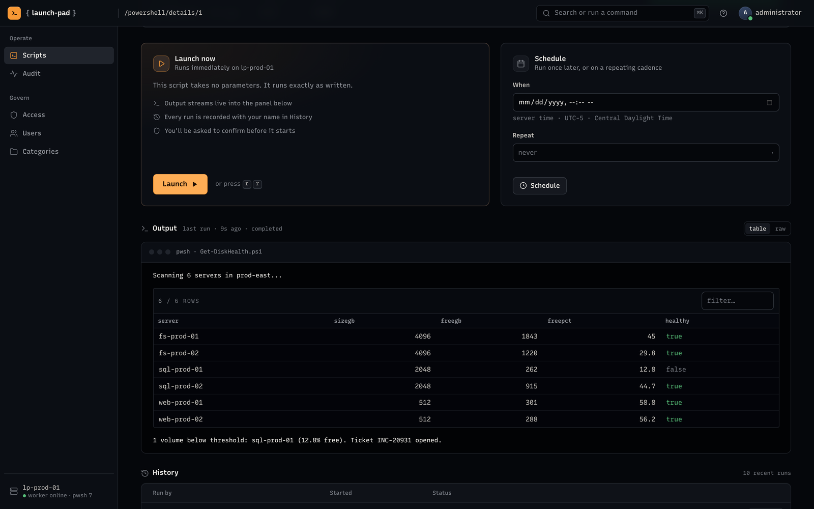
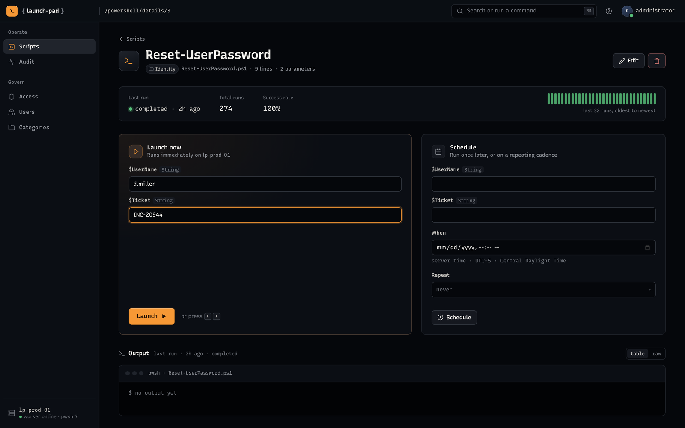
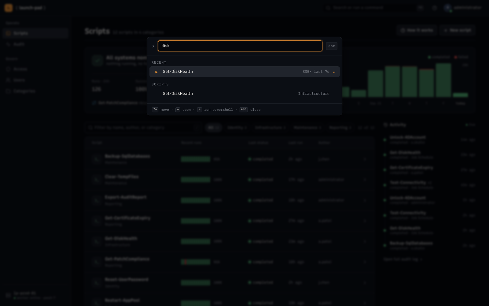
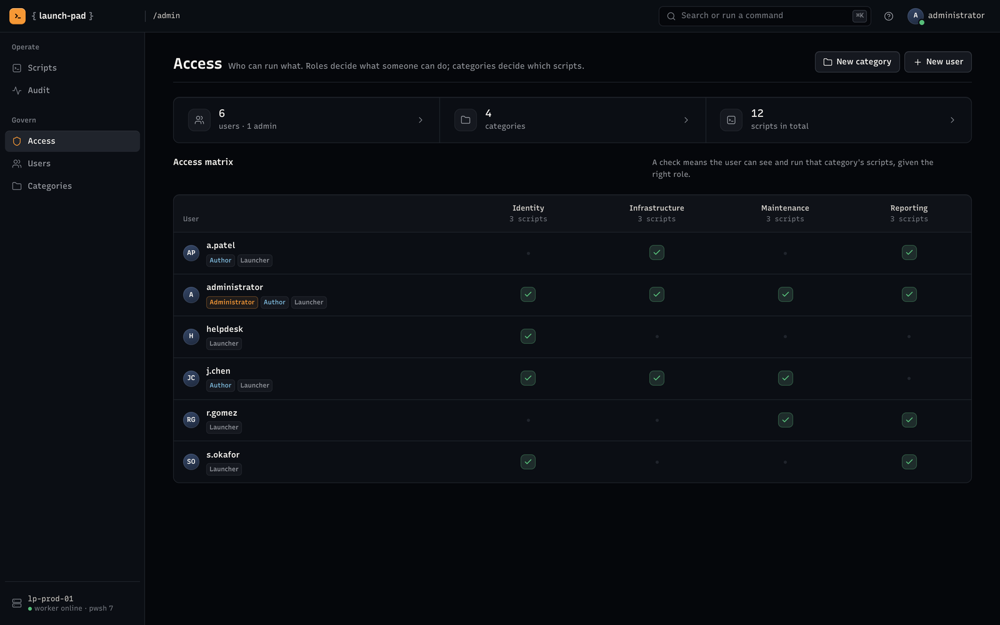
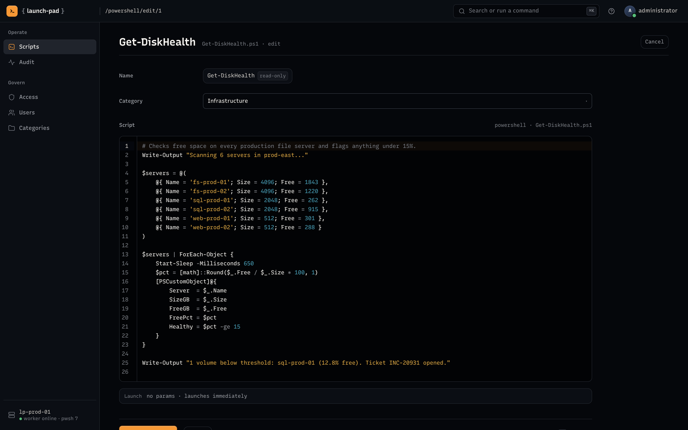

# { Launch-Pad }
[](https://github.com/michaelburns/LaunchPad/blob/master/LICENSE)

### The PowerShell command center
Every script your team runs, in one place: launch, schedule, and audit PowerShell from the browser, with access controls that make it safe to hand to the whole team.


ASP.NET Core 10 MVC, cross-platform (macOS, Linux, Windows Server). Scripts run on PowerShell 7 (`Microsoft.PowerShell.SDK`), so anything PowerShell 7 can run, LaunchPad can launch.

This project is looking for contributors. If you have a feature you'd like to see or a bug you'd like fixed, the fastest way to make it happen is to implement it and send it upstream. Every contribution gets a thorough look.

--------------

#### What it does

* **Know what's running at a glance.** Live status, 24-hour run and failure counts, and a 14-day activity chart on the home screen.
* **Every script's recent history.** Each script shows its last 16 runs as a strip of status ticks plus its success rate.
* **Launch with confidence.** One click arms, a second click launches. Output streams in live, and PowerShell objects render as sortable, filterable tables instead of text.
* **Parameters become forms.** A script's `param()` block turns into a launch form, so non-technical teammates can run it without touching PowerShell.
* **Schedule and recur.** Run once later or on a repeating cadence (powered by Hangfire).
* **Find anything with ⌘K.** A command palette to jump to any script, and for administrators, run ad-hoc PowerShell.
* **Who can run what.** Roles decide *what* someone can do (Administrator, Author, Launcher); categories decide *which scripts*. The access matrix shows both at once.
* **A real editor for authors.** CodeMirror 6 with PowerShell highlighting, draft autosave, and a live preview of detected parameters.
* **Every run on the record.** Who ran what, when, with which arguments, and what it printed.

--------------

#### Screenshots

##### Dashboard
Live status, 14-day activity, and every script's recent runs.



##### Launch and live output
Two-click launch, streaming output, and tables that stay tables.



##### Parameters as forms



##### Command palette (⌘K)



##### Access matrix



##### Script editor



--------------

#### Run it locally

Prerequisites:
- [.NET 10 SDK](https://dotnet.microsoft.com/download)
- `dotnet tool install --global dotnet-ef` (once)
- Node.js, only if you want to rebuild the editor bundle

```bash
git clone https://github.com/michaelburns/LaunchPad.git
cd LaunchPad/LaunchPad
dotnet dev-certs https --trust     # one-time, prompts for keychain password
dotnet ef database update          # creates launchpad.db (SQLite)
dotnet run                         # uses Properties/launchSettings.json
```

Open https://localhost:5181 (HTTP requests on :5180 redirect to HTTPS). The audit log (Hangfire dashboard) is at `/Scripts/Jobs`.

The PowerShell editor is a vendored CodeMirror 6 bundle (`wwwroot/lib/codemirror/ps-editor.bundle.js`). To change it, edit `wwwroot/js/ps-editor.src.js` and run `npm install && npm run build:editor`.

#### Configuration

| Setting | Default | Purpose |
| --- | --- | --- |
| `ConnectionStrings:DefaultConnection` | `Data Source=launchpad.db` | App data (EF Core, SQLite) |
| `ConnectionStrings:HangfireConnection` | `Data Source=launchpad-hangfire.db` | Background jobs (Hangfire.Storage.SQLite) |
| `PowerShellScripts:FolderLocation` | `./Scripts` | Where `.ps1` files live on disk |
| `LaunchPad:HostLabel` | machine name | Friendly host name shown in the sidebar and launch panel |

To use a different store (Postgres, SQL Server, etc.), swap the EF Core and Hangfire providers in `Program.cs` and update the connection strings.

#### Authentication

- **Production (Windows Server):** Negotiate / Windows Authentication via `Microsoft.AspNetCore.Authentication.Negotiate`, the same as classic IIS Windows Auth. The audit dashboard is restricted to Administrators.
- **Development (any OS):** an `ASPNETCORE_ENVIRONMENT=Development` build signs requests in as the seeded `administrator` account, so the role-protected pages work on machines without an AD domain.

#### Keyboard shortcuts

| Keys | Action |
| --- | --- |
| `⌘K` / `Ctrl+K` | Command palette |
| `/` | Filter scripts |
| `j` / `k`, `↵` | Move through and open scripts |
| `r` `r` | Launch the current script (confirmed) |
| `g h`, `g a`, `g u`, `g c` | Go to scripts, audit, users, categories |
| `?` | Shortcuts and concepts |

--------------

#### Roadmap
* Export and/or email script results
* Email alerts on failures
* Version history for scripts
* Custom end-user roles (Exchange, business departments)

--------------

#### Built With
* [.NET 10 + ASP.NET Core MVC](https://learn.microsoft.com/aspnet/core/) - Web framework
* [PowerShell SDK 7.5](https://github.com/PowerShell/PowerShell) - Cross-platform script execution
* [Hangfire](https://www.hangfire.io/) - Background and scheduled jobs
* [Entity Framework Core 10](https://learn.microsoft.com/ef/core/) - Data access (SQLite by default)
* [CodeMirror 6](https://codemirror.net/) - Script editor and read-only source viewer
* [Recursive](https://www.recursive.design/) - Interface and code typeface
